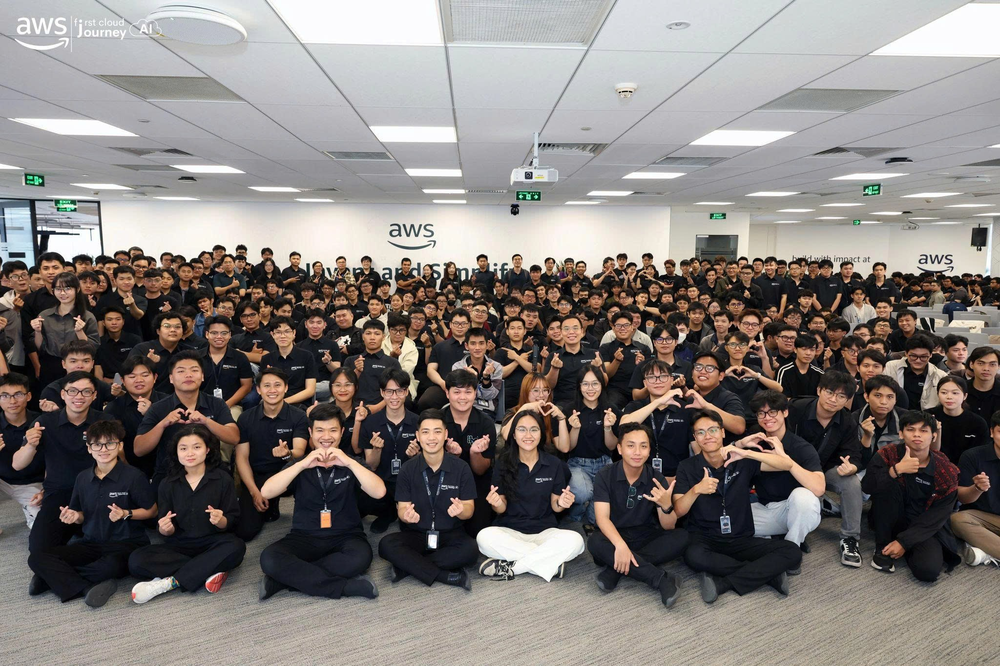

# BÀI THU HOẠCH: TỰ ĐỘNG HÓA CÔNG VIỆC VỚI TRỢ LÝ AI AMAZON Q VÀ MCP**

### Mục Đích Của Sự Kiện

* Giới thiệu **Amazon Q**, một trợ lý AI thân thiện được AWS phát triển dành cho người dùng cuối (end-user).
* Giải quyết bài toán tiêu tốn thời gian trong quá trình vận hành, báo cáo của doanh nghiệp.
* Làm rõ cơ chế hoạt động của Agent và cách sử dụng giao thức MCP (Model Context Protocol) để giúp AI tương tác với các ứng dụng bên ngoài.
* Truyền cảm hứng cho các lập trình viên về tư duy phát triển sản phẩm hướng tới việc giải quyết vấn đề thực tế của khách hàng.

### Danh Sách Diễn Giả

* **Hải An** - Cloud Consultant tại C Pacific Việt Nam (Diễn giả từng thuyết trình tại AWS Singapore Summit và Silicon Valley).

### Nội Dung Nổi Bật

Lấy người dùng làm trung tâm (User-centric)

* Trình độ kỹ thuật chỉ là một yếu tố; điều quan trọng nhất để tạo ra sản phẩm thành công là phải **giải quyết được vấn đề cho người dùng (user/customer)**.
* Ứng dụng AI giúp tự động hóa quá trình tập hợp dữ liệu làm báo cáo hàng tuần, giải phóng thời gian cho các cấp quản lý (Manager, C-level).

Hệ sinh thái tích hợp của Amazon Q

* AWS đã xây dựng một platform Agent có khả năng tích hợp chặt chẽ với các hệ sinh thái phổ biến như **Microsoft** (Word, Outlook, Teams, PowerPoint) và **Google** (Gmail, Calendar).

Khái niệm Agent và MCP (Model Context Protocol)

* Các mô hình ngôn ngữ lớn (LLM) rất thông minh nhưng bản thân chúng **không thể tự hành động** (ví dụ: tự đặt lịch hẹn hay gửi email).
* Để AI tương tác được với thế giới thực, hệ thống cần các hàm thực thi (Action/Function). Đây được gọi là giao thức **MCP - đóng vai trò như "những cánh tay nối dài"** kết nối AI với các nền tảng như Gmail, Jira, hay Confluence,.

Tự động hóa qua các luồng Demo thực tế

* **Tạo Dashboard phân tích:** Người dùng không cần kiến thức phân tích dữ liệu (BI) vẫn có thể tải một file Excel thô (ví dụ: dữ liệu bán hàng) lên hệ thống để Amazon Q tự động lập bảng phân tích và vẽ biểu đồ dashboard,.
* **Tóm tắt cuộc họp:** AI có khả năng chuyển đổi giọng nói thành văn bản (transcribe), tự động tóm tắt các quyết định quan trọng trong cuộc họp và kích hoạt MCP để tự động gửi email báo cáo các "bước tiếp theo" (next step) cho người tham gia,.

Tuân thủ Bảo mật

* Nền tảng hoạt động dựa trên Mô hình Trách nhiệm Chia sẻ (Security Shared Model) của AWS: AWS quản lý hạ tầng và các model nền tảng, trong khi người dùng tự quản lý dữ liệu và ứng dụng của mình.

### Những Gì Học Được

### Tư Duy Thiết Kế

* Sản phẩm công nghệ phải bắt đầu từ **nhu cầu cơ bản và gần gũi** của con người.
* Việc thiết kế hệ thống AI không chỉ dừng lại ở mức "hỏi - đáp" (chat) mà phải hướng tới việc biến AI thành một "người thực thi" (Agent) mang lại giá trị vận hành trực tiếp.

Kiến Trúc Kỹ Thuật

* Nắm bắt được khái niệm cốt lõi: **Agent = LLM + Các dịch vụ tính toán (Action/Function/MCP)**.
* Hiểu được cách nền tảng Amazon Q kết hợp khả năng xử lý của AI với các API của bên thứ ba để tạo ra một luồng tự động hóa (automation flow) hoàn chỉnh,.

Ứng Dụng Vào Công Việc

* **Nâng cao hiệu suất cá nhân/đội nhóm:** Sử dụng Amazon Q Desktop (phiên bản mới) để xử lý nhanh các tác vụ phân tích dữ liệu file Excel thành báo cáo trực quan mà không cần tốn thời gian thiết lập các công cụ BI phức tạp,.
* **Tự động hóa quy trình quản trị:** Nghiên cứu và phát triển thêm các module MCP nội bộ để tích hợp trợ lý AI với các công cụ đang dùng ở công ty (như Jira, Microsoft Teams) nhằm tự động hóa luồng theo dõi công việc và gửi nhắc nhở sau các cuộc họp,.

Trải nghiệm trong event

Học hỏi từ các diễn giả có chuyên môn cao

* Bài chia sẻ từ diễn giả Hải An mang tới nguồn cảm hứng lớn. Diễn giả nhấn mạnh rằng trình độ của mọi người là tương đương nhau, sự khác biệt nằm ở **sự tự tin** và khả năng kết nối cùng đồng đội để tạo ra những sản phẩm tuyệt vời.

Trải nghiệm kỹ thuật thực tế

* Được trực tiếp quan sát cách hệ thống phân rã một yêu cầu bằng ngôn ngữ tự nhiên (prompt) thành một "system prompt" cấu trúc hóa (bao gồm overview, key decisions, action items) để AI hiểu chính xác nhiệm vụ.
* Nhìn thấy tiềm năng mạnh mẽ của các **"cánh tay nối dài" MCP** trong việc biến một LLM thụ động thành một hệ thống chủ động thao tác với email và calendar,.

Ứng dụng công cụ hiện đại

* Được giới thiệu về nền tảng **Amazon Q** miễn phí và mở ra tư duy rằng các lập trình viên hoàn toàn có thể tự code thêm các MCP server để mở rộng khả năng của AI tùy theo bài toán của riêng mình

#### Một số hình ảnh khi tham gia sự kiện

* Thêm các hình ảnh của các bạn tại đây
* 

> Tổng thể, sự kiện không chỉ cung cấp kiến thức kỹ thuật mà còn giúp tôi thay đổi cách tư duy về thiết kế ứng dụng, hiện đại hóa hệ thống và phối hợp hiệu quả hơn giữa các team.
